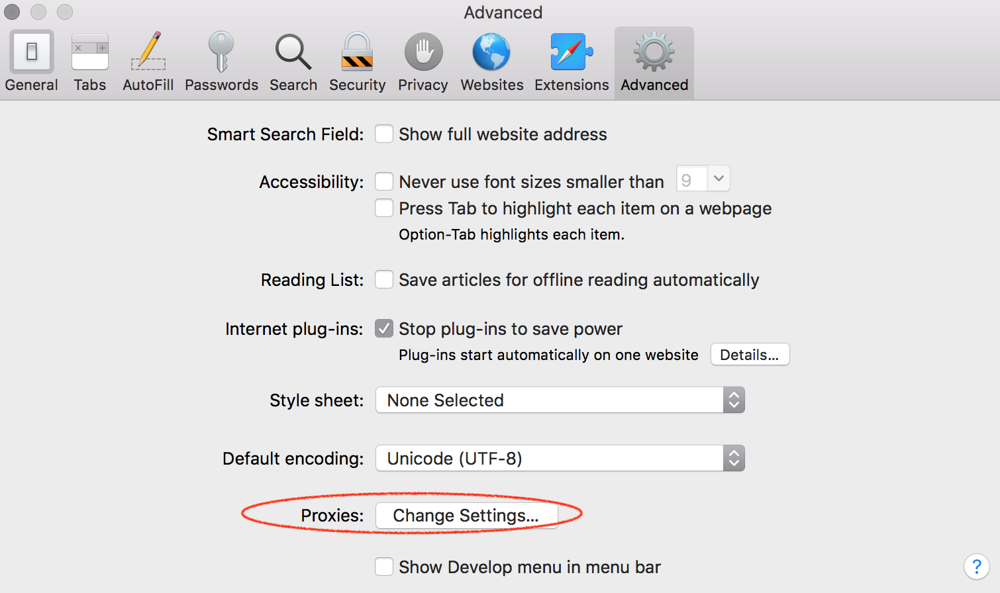
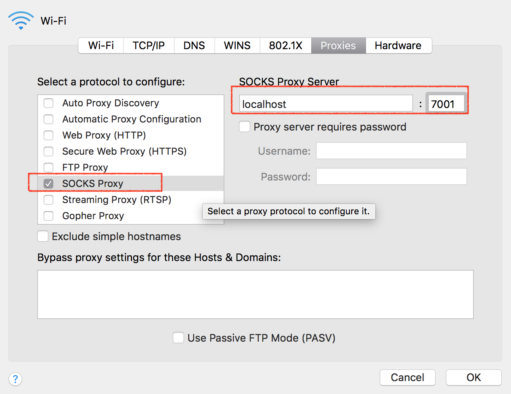

# SSH

- sshd - The SSH server on Unix/Linux
- sshd_config - Server configuration file on Unix/Linux
- ssh_config - Client configuration file on Unix/Linux
- SSH port, and how it got that number

## sshd. - The SSH server

sshd is the OpenSSH server process. It listens to incoming connections using the SSH protocol and acts as the server for the protocol. It handles user authentication, encryption, terminal connections, file transfers, and tunneling.

**VPS 安装OS(linux)时，自动安装了；**
**macOS 用 brew 安装。**

## configuration file

全局配置
* /etc/ssh/sshd_config  (server)
* /etc/ssh/ssh_config   (client)

当前用户配置
* ~/.ssh/authorized_keys (server)
* ~/.ssh/config    
* ~/.ssh/known_hosts


---
# 最佳的SSH命令

## 通过SSH挂载目录/文件系统
>允许你跨网络安全挂载一个目录
```
sshfs 用户名@远程主机:/path/to/folder /path/to/mount/point
```
>**This Office Website:**
https://osxfuse.github.io
>在苹果macOS中，用brew安装：先装osxfuse(It allows you to extend macOS's native file handling capabilities via third-party file systems), 后装sshfs.
```
brew cask install osxfuse   ;...OK
brew install sshfs
```

---

# SSH端口转发

SSH有三种端口转发模式，**本地端口转发(Local Port Forwarding)，远程端口转发(Remote Port Forwarding)以及动态端口转发(Dynamic Port Forwarding)** 。对于本地/远程端口转发，两者的方向恰好相反。
**动态端口转发**则可以用于科学上网。

SSH端口转发也被称作SSH隧道(SSH Tunnel)，因为它们都是通过SSH登陆之后，在SSH客户端与SSH服务端之间建立了一个隧道，从而进行通信。SSH隧道是非常安全的，因为SSH是通过加密传输数据的(SSH全称为Secure Shell)。

在本文所有示例中，本地主机A1为SSH客户端，远程云主机B1为SSH服务端。从A1主机通过SSH登陆B1主机，指定不同的端口转发选项(-L、-R和-D)，即可在A1与B1之间建立SSH隧道，从而进行不同的端口转发。

## 本地端口转发

**应用场景:**
>远程云主机B1运行了一个服务，端口为3000，本地主机A1需要访问这个服务。

示例为一个简单的Node.js服务:
```
var http = require('http');
var server = http.createServer(function(request, response)
{
    response.writeHead(200,
    {
        "Content-Type": "text/plain"
    });
    response.end("Hello Fundebug\n");
});
server.listen(3000);
```
假设云主机B1的IP为**103.59.22.17**，则该服务的访问地址为:**http://103.59.22.17:3000**

### 为啥需要本地端口转发呢？
>一般来讲，云主机的防火墙默认只打开了22端口，如果需要访问3000端口的话，需要修改防火墙。为了保证安全，防火墙需要配置允许访问的IP地址。但是，本地公忘IP通常是网络提供商动态分配的，是不断变化的。这样的话，防火墙配置需要经常修改，就会很麻烦。

### 什么是本地端口转发？
>所谓本地端口转发，就是将发送到本地端口的请求，转发到目标端口。这样，就可以通过访问本地端口，来访问目标端口的服务。使用-L属性，就可以指定需要转发的端口，语法是这样的:

`-L 本地网卡地址:本地端口:目标地址:目标端口`

>通过本地端口转发，可以将发送到本地主机A1端口2000的请求，转发到远程云主机B1的3000端口。
```
# 在本地主机A1登陆远程云主机B1，并进行本地端口转发
ssh -L localhost:2000:localhost:3000 root@103.59.22.17
```
>这样，在本地主机A1上可以通过访问http://localhost:2000来访问远程云主机B1上的Node.js服务。
```
# 在本地主机A1访问远程云主机B1上的Node.js服务
curl http://localhost:2000
Hello Fundebug
```
>实际上，-L选项中的本地网卡地址是可以省略的，这时表示2000端口绑定了本地主机A1的所有网卡：
```
# 在本地主机A1登陆远程云主机B1，并进行本地端口转发。2000端口绑定本地所有网卡
ssh -L 2000:localhost:3000 root@103.59.22.17
```
>若本地主机A2能够访问A1，则A2也可以通过A1访问远程远程云主机B1上的Node.js服务。

>另外，-L选项中的目标地址也可以是其他主机的地址。假设远程云主机B2的局域网IP地址为192.168.59.100，则可以这样进行端口转发:
```
# 在本地主机A1登陆远程云主机B1，并进行本地端口转发。请求被转发到远程云主机B2上
ssh -L 2000:192.168.59.100:3000 root@103.59.22.17
```
>若将Node.js服务运行在远程云主机B2上，则发送到A1主机2000端口的请求，都会被转发到B2主机上。

## 远程端口转发

**应用场景:**

>本地主机A1运行了一个服务，端口为3000，远程云主机B1需要访问这个服务。

>将前文的Node.js服务运行在本地，在本地就可以通过http://localhost:3000访问该服务。

**为啥需要远程端口转发呢？**

>通常，本地主机是没有独立的公网IP的，它与同一网络中的主机共享一个IP。没有公网IP，云主机是无法访问本地主机上的服务的。

### 什么是远程端口转发？

>所谓远程端口转发，就是将发送到远程端口的请求，转发到目标端口。这样，就可以通过访问远程端口，来访问目标端口的服务。使用-R属性，就可以指定需要转发的端口，语法是这样的:
```
-R 远程网卡地址:远程端口:目标地址:目标端口
```
>这时，通过远程端口转发，可以将发送到远程云主机B1端口2000的请求，转发到本地主机A1端口3000。
```
# 在本地主机A1登陆远程云主机B1，并进行远程端口转发
ssh -R localhost:2000:localhost:3000 root@103.59.22.17
```
>这样，在远程云主机A1可以通过访问http://localhost:2000来访问本地主机的服务。
```
# 在远程云主机B1访问本地主机A1上的Node.js服务
curl http://localhost:2000
Hello Fundebug
```
>同理，远程网卡地址可以省略，目标地址也可以是其他主机地址。假设本地主机A2的局域网IP地址为192.168.0.100。
```
# 在本地主机A1登陆远程云主机B1，并进行远程端口转发
ssh -R 2000:192.168.0.100:3000 root@103.59.22.17
```
>若将Node.js服务运行在本地主机A2上，则发送到远程云主机A1端口2000的请求，都会被转发到A2主机上。

## 动态端口转发

**应用场景:**

>远程云主机B1运行了多个服务，分别使用了不同端口，本地主机A1需要访问这些服务。

**为啥需要动态端口转发呢？**

>一方面，由于防火墙限制，本地主机A1并不能直接访问远程云主机B1上的服务，因此需要进行端口转发；另一方面，为每个端口分别创建本地端口转发非常麻烦。

### 什么是动态端口转发？

对于本地端口转发和远程端口转发，都存在两个一一对应的端口，分别位于SSH的客户端和服务端，而动态端口转发则只是绑定了一个本地端口，而目标地址:目标端口则是不固定的。目标地址:目标端口是由发起的请求决定的，比如，请求地址为192.168.1.100:3000，则通过SSH转发的请求地址也是192.168.1.100:3000。
```
-D 本地网卡地址:本地端口
```
>这时，通过动态端口转发，可以将在本地主机A1发起的请求，转发到远程主机B1，而由B1去真正地发起请求。
```
# 在本地主机A1登陆远程云主机B1，并进行动态端口转发
ssh -D localhost:7001 root@103.59.22.17
```
>而在本地发起的请求，需要由Socket代理(Socket Proxy)转发到SSH绑定的7001端口。以Safari浏览器为例，配置Socket代理需要找到Preferences>Advanced>Proxies->Socks:
 

>这样的话，Safari浏览器发起的请求都会转发到7001端口，然后通过SSH转发到真正地请求地址。若Node.js服务运行在远程云主机B1上，则在Safari中访问localhost:3000即可以访问。如果主机B1能够访问外网的话，则可以科学上网……

## 链式端口转发

>本地端口转发与远程端口转发结合起来使用，可以进行链式转发。假设A主机在公司，B主机在家，C主机为远程云主机。A主机上运行了前文的Node.js服务，需要在B主机上访问该服务。由于A和B不在同一个网络，且A主机没有独立公共IP地址，所以无法直接访问服务。

>通过本地端口转发，将发送到B主机3000端口的请求，转发到远程云主机C的2000端口。
```
# 在B主机登陆远程云主机C，并进行本地端口转发
ssh -R localhost:3000:localhost:2000 root@103.59.22.17
```
>通过远程端口转发，将发送到远程云主机C端口2000的请求，转发到A主机的3000端口。
```
# 在A主机登陆远程云主机C，并进行远程端口转发
ssh -R localhost:2000:localhost:3000 root@103.59.22.17
```
>这样，在主机B可以通过访问http://localhost:3000来访问主机A上的服务。

```
# 在主机B访问主机A上的服务
curl http://localhost:3000
Hello Fundebug
```


